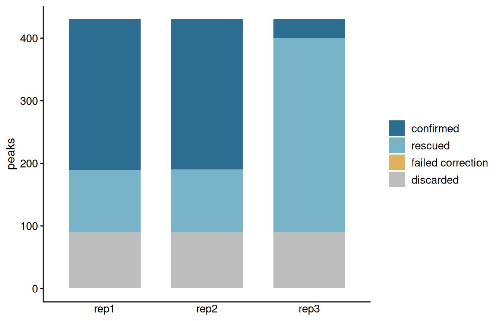
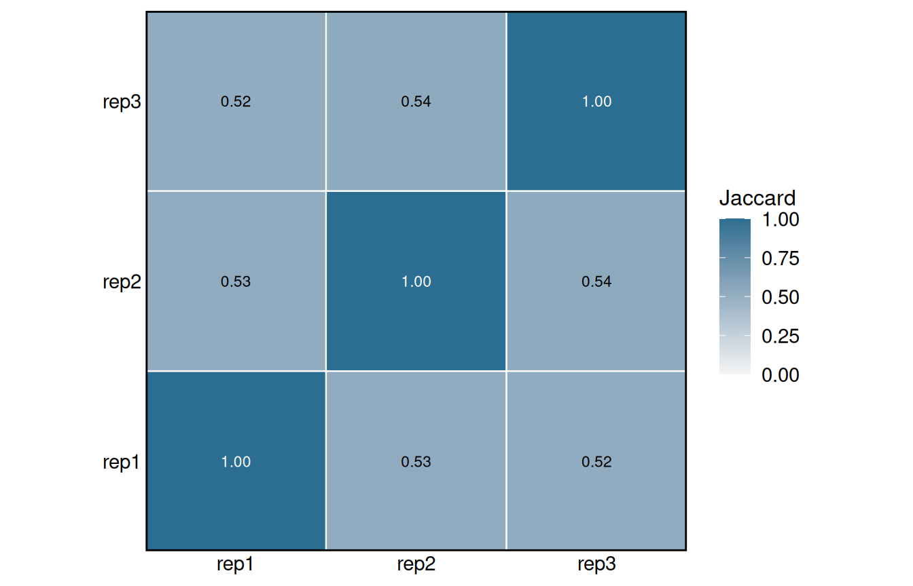
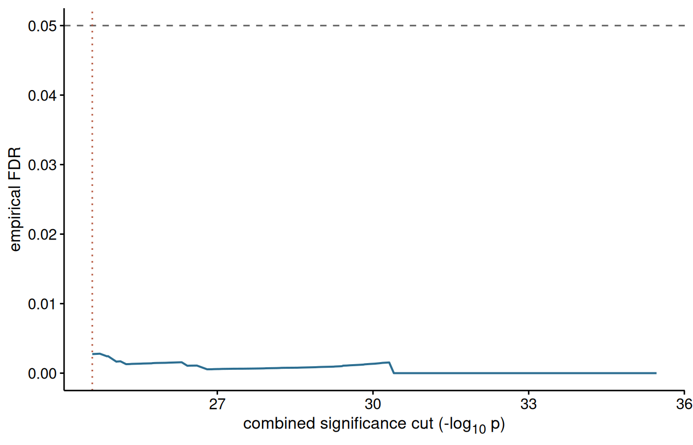

# Consensus regions across replicated experiments

------------------------------------------------------------------------

## **Introduction**

Replicates disagree. A region can be convincing in two samples and just
below threshold in the third, and the usual response, taking the
intersection of the peak sets, throws it away. Taking the union instead
keeps it along with every piece of noise the worst replicate produced.

`consensusRegions` does neither. Each peak is examined together with the
peaks that overlap it in the other replicates, and their p-values are
combined into one. Repeated weak evidence then adds up to something that
survives, while a strong peak nobody else saw does not. The idea comes
from [MSPC](https://genometric.github.io/MSPC/docs/) ([Jalili *et al.*,
2015](https://doi.org/10.1093/bioinformatics/btv293)); what is added
here is the ability to weight replicates, to calibrate the decision
threshold rather than fix it, and to work with peak files that have lost
their statistics.

``` r

library(consensusRegions)
```

  

## **Reading peaks**

The example data is three replicates over two chromosomes, with a
deliberately shallow third sample.

``` r
peakFiles <- system.file("extdata",
                         c("rep1.narrowPeak",
                           "rep2.narrowPeak",
                           "rep3.narrowPeak"),
                         package = "consensusRegions")

peaks <- readPeakSets(peakFiles, sampleNames = c("rep1", "rep2", "rep3"))
peaks
> GRangesList object of length 3:
> $rep1
> GRanges object with 430 ranges and 7 metadata columns:
>         seqnames          ranges strand |        name     score signalValue
>            <Rle>       <IRanges>  <Rle> | <character> <numeric>   <numeric>
>     [1]     chr1     57515-58142      * |      peak_1        98     2.72737
>     [2]     chr1   102197-103030      * |      peak_2       124     3.46213
>     [3]     chr1   145913-146341      * |      peak_3       192     5.35816
>     [4]     chr1   217889-218140      * |      peak_4        58     1.63109
>     [5]     chr1   235442-235885      * |      peak_5        85     2.37401
>     ...      ...             ...    ... .         ...       ...         ...
>   [426]     chr2 8631942-8632279      * |    peak_426        98     2.74174
>   [427]     chr2 8742508-8742933      * |    peak_427        61     1.71393
>   [428]     chr2 8745954-8746585      * |    peak_428       212     5.90034
>   [429]     chr2 8772842-8773607      * |    peak_429       204     5.66718
>   [430]     chr2 8862653-8863473      * |    peak_430       170     4.73122
>            pValue    qValue      peak negLog10P
>         <numeric> <numeric> <integer> <numeric>
>     [1]   8.18212   7.18212       295   8.18212
>     [2]  10.38638   9.38638       392  10.38638
>     [3]  16.07448  15.07448       236  16.07448
>     [4]   4.89327   3.89327       112   4.89327
>     [5]   7.12203   6.12203       220   7.12203
>     ...       ...       ...       ...       ...
>   [426]   8.22521   7.22521       188   8.22521
>   [427]   5.14178   4.14178       233   5.14178
>   [428]  17.70101  16.70101       299  17.70101
>   [429]  17.00155  16.00155       353  17.00155
>   [430]  14.19366  13.19366       435  14.19366
>   -------
>   seqinfo: 2 sequences from an unspecified genome; no seqlengths
> 
> $rep2
> GRanges object with 430 ranges and 7 metadata columns:
>         seqnames          ranges strand |        name     score signalValue
>            <Rle>       <IRanges>  <Rle> | <character> <numeric>   <numeric>
>     [1]     chr1     57552-58092      * |      peak_1       141     3.93745
>     [2]     chr1   102200-102630      * |      peak_2       118     3.28321
>     [3]     chr1   145909-146277      * |      peak_3       103     2.87270
>     [4]     chr1   201963-202312      * |      peak_4        67     1.87344
>     [5]     chr1   235377-235868      * |      peak_5        54     1.51754
>     ...      ...             ...    ... .         ...       ...         ...
>   [426]     chr2 8651848-8652239      * |    peak_426        56     1.57910
>   [427]     chr2 8742442-8742750      * |    peak_427        66     1.83676
>   [428]     chr2 8745997-8746366      * |    peak_428       108     3.02740
>   [429]     chr2 8772694-8773478      * |    peak_429       140     3.89196
>   [430]     chr2 8862514-8863166      * |    peak_430       114     3.18792
>            pValue    qValue      peak negLog10P
>         <numeric> <numeric> <integer> <numeric>
>     [1]  11.81234  10.81234       265  11.81234
>     [2]   9.84962   8.84962       214   9.84962
>     [3]   8.61810   7.61810       161   8.61810
>     [4]   5.62032   4.62032       170   5.62032
>     [5]   4.55263   3.55263       239   4.55263
>     ...       ...       ...       ...       ...
>   [426]   4.73729   3.73729       219   4.73729
>   [427]   5.51028   4.51028       161   5.51028
>   [428]   9.08219   8.08219       175   9.08219
>   [429]  11.67587  10.67587       402  11.67587
>   [430]   9.56377   8.56377       325   9.56377
>   -------
>   seqinfo: 2 sequences from an unspecified genome; no seqlengths
> 
> $rep3
> GRanges object with 430 ranges and 7 metadata columns:
>         seqnames          ranges strand |        name     score signalValue
>            <Rle>       <IRanges>  <Rle> | <character> <numeric>   <numeric>
>     [1]     chr1     57439-57955      * |      peak_1        92     2.55995
>     [2]     chr1   102191-102497      * |      peak_2        59     1.64347
>     [3]     chr1   145851-146446      * |      peak_3        69     1.93957
>     [4]     chr1   235338-235729      * |      peak_4        48     1.35000
>     [5]     chr1   240015-240714      * |      peak_5        66     1.84047
>     ...      ...             ...    ... .         ...       ...         ...
>   [426]     chr2 8742492-8743024      * |    peak_426        48     1.35000
>   [427]     chr2 8745833-8746478      * |    peak_427        82     2.30257
>   [428]     chr2 8772831-8773465      * |    peak_428        78     2.17616
>   [429]     chr2 8862620-8863418      * |    peak_429        57     1.60899
>   [430]     chr2 8986598-8986983      * |    peak_430        55     1.55471
>            pValue    qValue      peak negLog10P
>         <numeric> <numeric> <integer> <numeric>
>     [1]   7.67984   6.67984       234   7.67984
>     [2]   4.93041   3.93041       125   4.93041
>     [3]   5.81871   4.81871       304   5.81871
>     [4]   4.05000   3.05000       181   4.05000
>     [5]   5.52140   4.52140       369   5.52140
>     ...       ...       ...       ...       ...
>   [426]   4.05000   3.05000       264   4.05000
>   [427]   6.90770   5.90770       293   6.90770
>   [428]   6.52848   5.52848       324   6.52848
>   [429]   4.82697   3.82697       379   4.82697
>   [430]   4.66414   3.66414       180   4.66414
>   -------
>   seqinfo: 2 sequences from an unspecified genome; no seqlengths
```

[`readPeakSets()`](https://sebastian-gregoricchio.github.io/consensusRegions/reference/readPeakSets.md)
inspects the files and reports which statistic it can use. narrowPeak
keeps -log10 p-values in its eighth column, so those go straight in. A
BED with only a score gets rank-transformed. A bare BED3 has nothing at
all, and the analysis will fall back to counting replicates instead of
combining evidence.

  

### Call peaks permissively

This is the mistake that ruins the whole exercise, so it is worth saying
plainly. If you call peaks at `q < 0.05` and run the consensus on what
survives, there is nothing left to rescue and you have written an
intersection with extra steps. Call at something like `p < 1e-3` and let
[`buildConsensus()`](https://sebastian-gregoricchio.github.io/consensusRegions/reference/buildConsensus.md)
do the thresholding. The two-tier design assumes exactly this.

  

## **A first run**

``` r
result <- buildConsensus(peaks, verbose = FALSE)
result
> ConsensusRegions
>   replicates      : 3 ( rep1, rep2, rep3 )
>   score type      : log10pvalue 
>   combination     : stouffer 
>   combined cut    : 1e-08 
>   weights         : rep1=1, rep2=1, rep3=1 
>   consensus       : 292 regions
>   width (median)  : 786.5 bp
>   width (max)     : 2200 bp
```

The per-replicate summary is where to look first.

``` r
consensusStats(result)
>   replicate nTested nStringent nWeak nConfirmed nRescued nFalsePositive
> 1      rep1     430        241   189        340       99              0
> 2      rep2     430        240   190        340      100              0
> 3      rep3     430         30   400        340      310              0
>   nDiscarded rescueRate
> 1         90  0.2911765
> 2         90  0.2941176
> 3         90  0.9117647
```

`nRescued` counts peaks that were only weak on their own and were kept
because the others agreed. That number is the reason to use this method,
and also the thing to be suspicious of. If it dwarfs everything else,
`weakThreshold` is too permissive and the combination is confirming
noise.

``` r

plotRescue(result)
```



The consensus regions carry the number of contributing replicates and a
significance recomputed from their member peaks.

``` r
head(consensusRanges(result), 3)
> GRanges object with 3 ranges and 4 metadata columns:
>       seqnames        ranges strand | nReplicates    nPeaks     replicates
>          <Rle>     <IRanges>  <Rle> |   <integer> <integer>    <character>
>   [1]     chr1   57439-58142      * |           3         3 rep1,rep2,rep3
>   [2]     chr1 102191-103030      * |           3         3 rep1,rep2,rep3
>   [3]     chr1 145851-146446      * |           3         3 rep1,rep2,rep3
>       combinedNegLog10P
>               <numeric>
>   [1]           25.2442
>   [2]           22.3973
>   [3]           26.9232
>   -------
>   seqinfo: 2 sequences from an unspecified genome; no seqlengths
```

  

## **Weighting the replicates**

Fisher’s method treats every replicate as equally informative. Yours
probably are not: one is shallower, or has a worse antibody, or was
prepared on a bad day. The choices are usually to drop it, which wastes
data, or to keep it and let it drag the combined statistic around.
Weighting is the third option.

When the BAM files are available, FRiP and library size can be measured
directly:

``` r

weights <- computeReplicateWeights(
    peaks,
    method = "frip",
    bamFiles = c("rep1.bam", "rep2.bam", "rep3.bam"))
```

More often the alignments are long gone and only the numbers survive in
an old QC report. Pass them in:

``` r
weights <- computeReplicateWeights(peaks, method = "frip",
                                   frip = c(0.21, 0.19, 0.06),
                                   verbose = FALSE)
weights
>      rep1      rep2      rep3 
> 1.3695652 1.2391304 0.3913043 
> attr(,"metrics")
> 
[38;5;246m# A tibble: 3 × 3
[39m
>   replicate  frip librarySize
>   
[3m
[38;5;246m<chr>
[39m
[23m     
[3m
[38;5;246m<dbl>
[39m
[23m       
[3m
[38;5;246m<dbl>
[39m
[23m
> 
[38;5;250m1
[39m rep1       0.21          
[31mNA
[39m
> 
[38;5;250m2
[39m rep2       0.19          
[31mNA
[39m
> 
[38;5;250m3
[39m rep3       0.06          
[31mNA
[39m
```

And when there is nothing but the peaks themselves, each replicate can
be scored by how well it agrees with the others:

``` r
computeReplicateWeights(peaks, method = "intrinsic", verbose = FALSE)
>      rep1      rep2      rep3 
> 0.9925346 1.0069021 1.0005633 
> attr(,"metrics")
> 
[38;5;246m# A tibble: 3 × 2
[39m
>   replicate jaccard
>   
[3m
[38;5;246m<chr>
[39m
[23m       
[3m
[38;5;246m<dbl>
[39m
[23m
> 
[38;5;250m1
[39m rep1        0.525
> 
[38;5;250m2
[39m rep2        0.533
> 
[38;5;250m3
[39m rep3        0.529
```

That last measure is circular, since agreement is also what the
consensus is testing. Use it when there is no alternative, not in
preference to FRiP.

Weights only reach the combination through Stouffer’s Z or Lancaster’s
method. Fisher and the rank product ignore them.

``` r
weighted <- buildConsensus(peaks, weights = weights,
                           combinationMethod = "stouffer",
                           verbose = FALSE)
consensusStats(weighted)
>   replicate nTested nStringent nWeak nConfirmed nRescued nFalsePositive
> 1      rep1     430        241   189        340       99              0
> 2      rep2     430        240   190        340      100              0
> 3      rep3     430         30   400        340      310              0
>   nDiscarded rescueRate
> 1         90  0.2911765
> 2         90  0.2941176
> 3         90  0.9117647
```

``` r

plotJaccard(weighted)
```



  

## **Choosing the combination**

| Method | Weights | Use it when |
|----|----|----|
| `fisher` | no | Reproducing MSPC, or replicates really are comparable |
| `stouffer` | yes | Default. Replicate quality varies |
| `lancaster` | yes | Weights wanted, Fisher-like sensitivity to one strong peak |
| `rankProduct` | no | Only scores available, or p-values you do not trust |

One caveat about Fisher that matters more than it usually gets credit
for: the combined statistic keeps accumulating as replicates are added.
With three samples this is fine. With twenty donors, a region detected
faintly in all of them starts to look overwhelmingly significant, which
is not what anyone means by reproducible. Stouffer and the rank product
degrade more gracefully at that scale.

The threshold does not carry across methods. Fisher, Stouffer and
Lancaster all sit on roughly the same scale, so a cut chosen for one is
a reasonable starting point for the others. The rank product does not.
It works on relative ranks, so the best a peak can possibly do is come
first in every replicate, and that bound depends on how many peaks each
replicate holds. With the few hundred peaks in this example the smallest
attainable combined p-value is around `1e-4`, and asking for `1e-8`
would return nothing at all.
[`buildConsensus()`](https://sebastian-gregoricchio.github.io/consensusRegions/reference/buildConsensus.md)
checks for this and refuses rather than handing back an empty result:

``` r
buildConsensus(peaks, combinationMethod = "rankProduct", verbose = FALSE)
> 
[1m
[33mError
[39m in `buildConsensus()`:
[22m
> 
[33m!
[39m the rank product cannot reach a combined p-value of 1e-08 with these peak sets: the smallest attainable is 7.07e-05, because the statistic is bounded by the number of peaks per replicate. Lower 'combinedThreshold', or let calibrateThreshold() choose one
```

Give it a threshold on its own scale, or let the calibration below pick
one:

``` r
ranked <- buildConsensus(peaks, combinationMethod = "rankProduct",
                         combinedThreshold = 0.05, verbose = FALSE)
length(ranked)
> [1] 38
```

That returns far fewer regions than the other three schemes do, and the
reason is the size of the example rather than any weakness in the
method. With only a few hundred peaks per replicate the finest relative
rank available is about 1/430, which is not a small number, so no peak
can accumulate much evidence however well it ranks. On a real peak set
of 10^5 calls the ranks are three orders of magnitude finer and the rank
product becomes competitive. Judge it on your own data, not here.

  

## **Calibrating the threshold**

The cut on the combined p-value is conventionally `1e-8`. That number is
a guess, and the right one depends on the number of replicates, how the
peaks were called, and how densely they sit.

[`calibrateThreshold()`](https://sebastian-gregoricchio.github.io/consensusRegions/reference/calibrateThreshold.md)
estimates it. Peak positions are shuffled within each chromosome,
keeping widths, counts and statistics, so any overlap between the
shuffled replicates arises by chance. Running the combination on those
gives a null, and the threshold is read off where the expected number of
null peaks falls to a chosen fraction of the observed count.

``` r
calibration <- calibrateThreshold(peaks, nPermutations = 10,
                                  targetFDR = 0.05, seed = 1,
                                  verbose = FALSE)

calibration$threshold
> [1] 2.565737e-25
```

``` r

plotCalibration(calibration)
```



``` r
calibrated <- buildConsensus(peaks,
                             combinedThreshold = calibration$threshold,
                             verbose = FALSE)
length(calibrated)
> [1] 122
```

Ten permutations is enough for a demonstration; fifty is a reasonable
working number. Passing a blacklist through `excludeRegions` makes the
null more honest, because shuffled peaks otherwise land in artefact
regions where real peaks cluster too.

  

## **Input without statistics**

Sometimes all that survives of an old analysis is a folder of BED3
files. There is no p-value to combine, so the package says so and
switches to a weighted presence rule: a region is kept when the weights
of the replicates supporting it sum to at least `minSupport`. With equal
weights that is the familiar k-of-n rule.

``` r
minimalFile <- system.file("extdata", "rep1_minimal.bed",
                           package = "consensusRegions")

minimal <- readPeakSets(rep(minimalFile, 3),
                        sampleNames = c("a", "b", "c"))

minimalResult <- buildConsensus(minimal, verbose = FALSE)
analysisParameters(minimalResult)$presenceOnly
> [1] TRUE
```

This is a fallback, not an equivalent. Without per-peak statistics
nothing can be rescued, and the result is reproducibility filtering
rather than combined evidence.

  

## **Merging, and relative issues**

Peak A overlaps B, B overlaps C, and A never touches C. Transitive
merging puts all three in one region, and on permissive input this
occasionally produces regions tens of kilobases long that mean nothing.

Two defences. `maxConsensusWidth` catches oversized regions and rebuilds
only those. `mergeMethod = "iterative"` avoids the problem entirely by
seeding on the most significant peak, claiming what it overlaps, and
repeating, which is the approach the ATAC-seq peak atlases use.

``` r
seeded <- buildConsensus(peaks, mergeMethod = "iterative",
                         verbose = FALSE)

summary(GenomicRanges::width(consensusRanges(result)))
>    Min. 1st Qu.  Median    Mean 3rd Qu.    Max. 
>   418.0   633.5   786.5   814.7   883.2  2200.0
summary(GenomicRanges::width(consensusRanges(seeded)))
>    Min. 1st Qu.  Median    Mean 3rd Qu.    Max. 
>   418.0   631.5   794.0   784.7   888.5  1400.0
```

  

## **Fixed-width regions**

Consensus regions inherit their edges from whichever peaks were merged,
so their widths vary. That variation biases everything downstream: a
wider region collects more reads and more motif matches for reasons that
have nothing to do with biology. For transcription factors and ATAC
data, recentre on the summit and use a common width.

``` r
fixed <- recentrePeaks(result, width = 400, summitSource = "best")
head(fixed, 3)
> GRanges object with 3 ranges and 5 metadata columns:
>       seqnames        ranges strand | nReplicates    nPeaks     replicates
>          <Rle>     <IRanges>  <Rle> |   <integer> <integer>    <character>
>   [1]     chr1   57617-58016      * |           3         3 rep1,rep2,rep3
>   [2]     chr1 102389-102788      * |           3         3 rep1,rep2,rep3
>   [3]     chr1 145949-146348      * |           3         3 rep1,rep2,rep3
>       combinedNegLog10P    summit
>               <numeric> <numeric>
>   [1]           25.2442     57817
>   [2]           22.3973    102589
>   [3]           26.9232    146149
>   -------
>   seqinfo: 2 sequences from an unspecified genome; no seqlengths
```

Do not do this to broad histone domains. Collapsing a domain to a point
discards the thing being measured.

  

## **Handing over to a differential analysis**

If the consensus is a step on the way to differential binding rather
than the endpoint, convert it and count reads over the row ranges with
csaw, DiffBind or edgeR.

``` r
se <- asSummarizedExperiment(result)
se
> class: RangedSummarizedExperiment 
> dim: 292 3 
> metadata(15): scoreType combinationMethod ... maxConsensusWidth
>   presenceOnly
> assays(2): negLog10P detected
> rownames: NULL
> rowData names(4): nReplicates nPeaks replicates combinedNegLog10P
> colnames(3): rep1 rep2 rep3
> colData names(2): replicate weight
```

The assay holds per-replicate significance, not counts. It is useful for
spotting a replicate that disagrees with the others; it is not a
substitute for counting reads.

And a word on where to spend your effort. If the consensus is an
intermediate, do not over-engineer it. Aggressive filtering upfront
mostly discards peaks that a proper count-based model would have handled
correctly anyway. The stringency of this package earns its keep when the
peak set is the deliverable.

  

## **Blacklisting**

Filter after the consensus, not before. Removing regions upfront
distorts the rank distributions the combination relies on, which is why
`excludeRegions` is applied at the end of
[`buildConsensus()`](https://sebastian-gregoricchio.github.io/consensusRegions/reference/buildConsensus.md).

``` r

result <- buildConsensus(peaks, excludeRegions = blacklistGRanges)
```

  

## **Checking the result**

Nothing in this package can tell you whether your consensus set is any
good. Validate it against something orthogonal: central motif enrichment
for a transcription factor, TSS enrichment and cCRE overlap for ATAC,
correlation with expression for activating marks. If the rescued peaks
are motif-poor and TSS-depleted, the settings are too permissive
regardless of what the statistics say.

------------------------------------------------------------------------

## **Session info**

    > R version 4.6.1 (2026-06-24)
    > Platform: x86_64-pc-linux-gnu
    > Running under: Ubuntu 24.04.4 LTS
    > 
    > Matrix products: default
    > BLAS:   /usr/lib/x86_64-linux-gnu/openblas-pthread/libblas.so.3 
    > LAPACK: /usr/lib/x86_64-linux-gnu/openblas-pthread/libopenblasp-r0.3.26.so;  LAPACK version 3.12.0
    > 
    > locale:
    >  [1] LC_CTYPE=en_US.UTF-8       LC_NUMERIC=C              
    >  [3] LC_TIME=en_US.UTF-8        LC_COLLATE=en_US.UTF-8    
    >  [5] LC_MONETARY=en_US.UTF-8    LC_MESSAGES=en_US.UTF-8   
    >  [7] LC_PAPER=en_US.UTF-8       LC_NAME=C                 
    >  [9] LC_ADDRESS=C               LC_TELEPHONE=C            
    > [11] LC_MEASUREMENT=en_US.UTF-8 LC_IDENTIFICATION=C       
    > 
    > time zone: Europe/Amsterdam
    > tzcode source: system (glibc)
    > 
    > attached base packages:
    > [1] stats4    stats     graphics  grDevices utils     datasets  methods  
    > [8] base     
    > 
    > other attached packages:
    > [1] consensusRegions_0.99.0 GenomicRanges_1.64.0    Seqinfo_1.2.0          
    > [4] IRanges_2.46.0          S4Vectors_0.50.2        BiocGenerics_0.58.1    
    > [7] generics_0.1.4          BiocStyle_2.40.0       
    > 
    > loaded via a namespace (and not attached):
    >  [1] tidyselect_1.2.1            dplyr_1.2.1                
    >  [3] farver_2.1.2                Biostrings_2.80.2          
    >  [5] S7_0.2.2                    bitops_1.1-0               
    >  [7] fastmap_1.2.0               RCurl_1.98-1.20            
    >  [9] GenomicAlignments_1.48.0    XML_3.99-0.24              
    > [11] digest_0.6.39               lifecycle_1.0.5            
    > [13] magrittr_2.0.5              compiler_4.6.1             
    > [15] rlang_1.3.0                 sass_0.4.10                
    > [17] tools_4.6.1                 utf8_1.2.6                 
    > [19] yaml_2.3.12                 rtracklayer_1.72.0         
    > [21] knitr_1.51                  labeling_0.4.3             
    > [23] S4Arrays_1.12.0             htmlwidgets_1.6.4          
    > [25] curl_8.0.0                  DelayedArray_0.38.2        
    > [27] xml2_1.6.0                  RColorBrewer_1.1-3         
    > [29] abind_1.4-8                 BiocParallel_1.46.0        
    > [31] withr_3.0.3                 purrr_1.2.2                
    > [33] desc_1.4.3                  grid_4.6.1                 
    > [35] ggplot2_4.0.3               scales_1.4.0               
    > [37] dichromat_2.0-1             SummarizedExperiment_1.42.0
    > [39] cli_3.6.6                   rmarkdown_2.32             
    > [41] crayon_1.5.3                ragg_1.5.2                 
    > [43] otel_0.2.0                  rstudioapi_0.19.0          
    > [45] httr_1.4.9                  rjson_0.2.23               
    > [47] commonmark_2.0.0            cachem_1.1.0               
    > [49] stringr_1.6.0               parallel_4.6.1             
    > [51] BiocManager_1.30.27         XVector_0.52.0             
    > [53] restfulr_0.0.17             matrixStats_1.5.0          
    > [55] vctrs_0.7.3                 Matrix_1.7-6               
    > [57] jsonlite_2.0.0              litedown_0.11              
    > [59] bookdown_0.48               systemfonts_1.3.2          
    > [61] jquerylib_0.1.4             tidyr_1.3.2                
    > [63] glue_1.8.1                  pkgdown_2.2.1              
    > [65] codetools_0.2-20            ggtext_0.2.0               
    > [67] stringi_1.8.9               gtable_0.3.6               
    > [69] GenomeInfoDb_1.48.0         BiocIO_1.22.0              
    > [71] UCSC.utils_1.8.0            tibble_3.3.1               
    > [73] pillar_1.11.1               htmltools_0.5.9            
    > [75] R6_2.6.1                    textshaping_1.0.5          
    > [77] evaluate_1.0.5              lattice_0.23-1             
    > [79] Biobase_2.72.0              markdown_2.0               
    > [81] Rsamtools_2.28.0            cigarillo_1.2.1            
    > [83] gridtext_0.1.6              bslib_0.12.0               
    > [85] Rcpp_1.1.2                  SparseArray_1.12.2         
    > [87] xfun_0.60                   fs_2.1.0                   
    > [89] MatrixGenerics_1.24.0       pkgconfig_2.0.3
